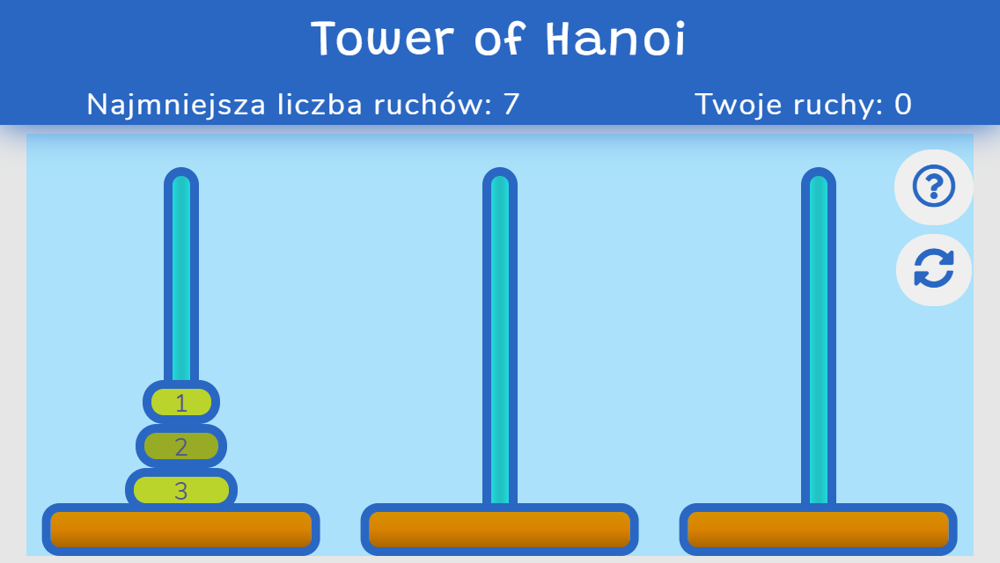

# Tower of Hanoi 
 Tower of Hanoi is a simple game inspired a puzzle invented by French mathematician Édouard Lucas in 1883.
 
 Welcome game screen: 
 
 
 
 Main game screen 

### Game Rules
The objective of the puzzle is to move the stack to another peg following these simple rules.

1. Only one disk can be moved at a time.
2. Larger disk cannot be put on a smaller disk.
3. All disks must rest on the last peg from largest to smallest.

 
### Technologies

- JavaScript
- CSS(SCSS)
- HMTL

### DEMO
[Tower of Hanoi Game DEMO](https://erykfryderyk.github.io/Tower-of-Hanoi-Game/)
